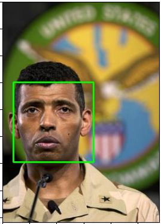

# Viola-Jones algorithm on GPU
- This is an implementation of the [Viola-Jones](https://www.cs.cmu.edu/~efros/courses/LBMV07/Papers/viola-IJCV-01.pdf) algorithm for face detection using PyToch. 
- It uses PyTorch&CUDA to perform matrix operations. 
- Its training time is 8.5 times faster than sklearn. 
- Feature extraction, training, and inference all were implemented using torch to utilize GPU.
- It was trained on the [FDDB](http://vis-www.cs.umass.edu/fddb/) dataset. 
- Cropped faces, non-faces can be found [here](https://drive.google.com/file/d/1VcAfLbUtzsTI3t_NjxQ7mYFOWZvh8HSX/view?usp=sharing)
  

